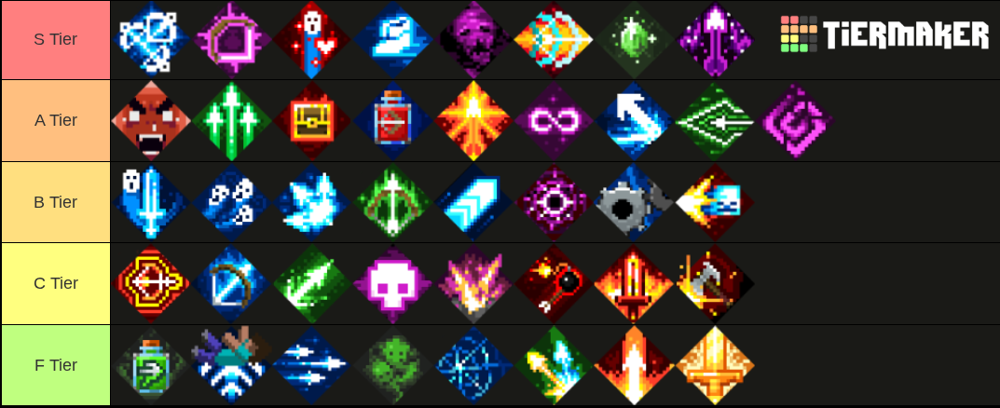

# 😺 Tierlist

## Enchantment Tierlist

Based on the best uses the enchantments have, and in general. 

For example, chilling reduces mob speed while snowball stuns mobs but can also activate ambush, and fight one mob at a time so it has better uses on some builds.

## Artifact Tierlist

Mostly based on the best uses artifacts can get. (In my opinion, though I haven't tried everything.)

## Bow Enchantment Tierlist

Based on best uses the enchantments have, and in general. 

For example, ricochet is great for many builds but radiance shot is above it because on few builds it gives much more radiance than fighter bindings with mushroom even.

## Armor Tierlist

Based on the best uses armors have. For example, the best builds and how many builds it is good on. Rolling builds are usually better, and I value damage reduction a lot.

