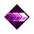

# 🎃 Halloween Stings By The Shrieks From Its Wings

## 📜 The Story of Halloween

**Halloween gets its name,**  
**from the demons that played a game.**  
**A game that had sacrifices with song,**  
**songs that would bring monsters along.**

**The monsters would then circle around a camp,**  
**monsters like skeletons, werewolves and vamps.**  
**They would chant a great song for their lord,**  
**so that he would rise and kill the humans with his sword.**

**Upon his back were huge wings,**  
**wings that would also sing.**  
**They shrieked out a fine tune that made ears bleed,**  
**all that was good would die and sprout the seeds...**

**The seeds of the great pumpkins that grew on Halloween,**  
**the pumpkins that would grow from organs like the spleen.**  
**Pumpkins that would grow and give birth to great power,**  
**power that would shoot out of their flowers.**

**There would also be clouds of pollen that was created,**  
**to trick the humans and keep them separated.**  
**All of this was done on Halloween,**  
**for evil needs to rise and wipe the Earth clean.**

---

## ⚔️ Required Gear

- .webp){ width="32" } **The Spooky Gourdian**  > .webp){ width="32" } + { width="32" } + { width="32" } + .webp){ width="32" } / { width="32" }
- .webp){ width="32" } **Nameless Blade**  > .webp){ width="32" } + { width="32" } + { width="32" } + { width="32" } / .webp){ width="32" }
- .webp){ width="32" } **Phantom Bow**  > { width="32" } + .webp){ width="32" } + { width="32" } + { width="32" } / { width="32" }
- .webp){ width="32" } **Shrieking Crossbow**  > { width="32" } + { width="32" } + { width="32" } + { width="32" } / { width="32" }

### Artifacts
- { width="32" } **Void Quiver** 
- .webp){ width="32" } **Corrupted Pumpkin** 
- .webp){ width="32" } **Shock Powder** 

### Cosmetics
- **Fuego skin** 
- **Sinister cape** 
- **Phantom familiar pet** 

---

## 💡 Build Notes

This Halloween-themed build focuses on dark, spooky aesthetics combined with powerful soul and elemental damage synergies. The build uses the Corrupted Pumpkin and Shock Powder artifacts to create devastating area effects while maintaining a terrifying presence on the battlefield.

---

!!! danger "Dark Power"
    This build embraces the chaos of Halloween! Master the shrieking attacks and pumpkin powers to overwhelm your enemies! 💀🎃
