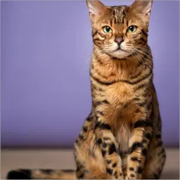
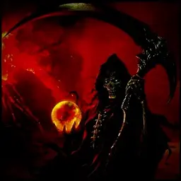

<section class="landing-section landing-section--intro">
  

    <h2>Welcome to DungeonsHub</h2>
    
Your central hub for Minecraft Dungeons mastery. From beginner basics to advanced strategies, discover comprehensive guides created by the community's best players.

    

      Featuring 391 expert guides crafted by 6 amazing contributors
    

  

</section>

<section class="landing-section landing-section--creators" id="guide-creators">
  

    <h2>🎮 Guide Creators</h2>
    
Learn from the experts who've mastered every aspect of the game

    
    

      <a href="agenciak/" class="guide-card-link">
        

          
          <h3 class="guide-card-title">Agenciak's Guides</h3>
          
Comprehensive beginner-friendly guides covering melee combat, rolling mechanics, and powerful builds.

        

      </a>

      <a href="bustercat/" class="guide-card-link">
        

          
          <h3 class="guide-card-title">BusterCat's Guides</h3>
          
Expert strategies and powerful builds to maximize your efficiency and dominate the dungeons.

        

      </a>

      <a href="grimreaper/" class="guide-card-link">
        

          
          <h3 class="guide-card-title">GrimReaper's Guides</h3>
          
Creative collection: 262 themed builds inspired by pop culture, mythology, and legends. Fun, roleplay-focused strategies—not meta builds.

        

      </a>

      <a href="pancake/" class="guide-card-link">
        

          
          <h3 class="guide-card-title">Pancake's Guides</h3>
          
Creative builds and unique strategies offering fresh perspectives and innovative solutions.

        

      </a>

      <a href="shins/" class="guide-card-link">
        

          
          <h3 class="guide-card-title">Shin's Guides</h3>
          
Massive collection: 98 guides covering mechanics, all 53 melee weapons, and all 35 armor sets. Complete system analysis with data-driven insights.

        

      </a>

      <a href="reddit/" class="guide-card-link">
        

          
💬

          <h3 class="guide-card-title">Reddit Guides</h3>
          
Community-curated guides from the Minecraft Dungeons subreddit. Learn from the best players.

        

      </a>

      <a href="other/" class="guide-card-link">
        

          
🔗

          <h3 class="guide-card-title">Other Sources</h3>
          
Additional resources, tools, and guides from around the web. Calculators, wikis, and more!

        

      </a>
    

  

</section>

<section class="landing-section landing-section--features">
  

    <h2>✨ What You'll Find Here</h2>
    
Comprehensive resources to elevate your gameplay

    
    

      

        
⚔️

        <h3>Combat Strategies</h3>
        
Master melee and ranged combat techniques with detailed breakdowns and practical tips

      

      

        
🎯

        <h3>Build Optimization</h3>
        
Create powerful synergistic builds that maximize damage and survivability

      

      

        
📊

        <h3>Tier Lists</h3>
        
Best weapons, armor, and artifacts ranked by performance and utility

      

      

        
🗺️

        <h3>Level Walkthroughs</h3>
        
Complete guides for every level with secrets, strategies, and boss tactics

      

      

        
💎

        <h3>Enchantment Guides</h3>
        
Optimize your enchantment choices for maximum effectiveness

      

      

        
🏆

        <h3>Endgame Content</h3>
        
Conquer Apocalypse+ difficulty with proven strategies and builds

      

    

  

</section>

<section class="landing-section landing-section--quickstart">
  

    <h2>🚀 Quick Start Guide</h2>
    
Not sure where to begin? We'll point you in the right direction

    
    

      

        <h3>🌱 New Players</h3>
        
Start with <a href="agenciak/">Agenciak's Guides</a> for beginner-friendly content covering the fundamentals of combat and builds.

      

      

        <h3>🎨 Creative Strategists</h3>
        
Check out <a href="bustercat/">BusterCat's</a> or <a href="pancake/">Pancake's Guides</a> for unique and innovative approaches to the game.

      

      

        <h3>🧠 Understanding Mechanics</h3>
        
Dive into <a href="shins/">Shin's Guides</a> to learn how the game actually works—enchantment scaling, AI behavior, and why builds succeed or fail.

      

      

        <h3>⚡ Power Builds</h3>
        
<a href="grimreaper/">GrimReaper's Guides</a> feature devastating builds focused on soul power and dark arts.

      

    

  

</section>

<section class="landing-section landing-section--featured">
  

    <h2>🔥 Featured Guides</h2>
    
Popular guides to get you started

    
    

      

        
⚔️

        <h3><a href="agenciak/agenciak-melee-guide/">Melee Combat Guide</a></h3>
        
Learn weapon types, enchantment synergies, and combat strategies for beginners.

      

      

        
💨

        <h3><a href="agenciak/agenciak-rolling-guide/">Rolling Mechanics Guide</a></h3>
        
Master the art of constant rolling with Burstbowstring and Cooldown Shot. Understanding i-frames and defensive tactics.

      

      

        
🎃

        <h3><a href="grimreaper/grimreaper-halloween-stings-build/">Halloween Stings Build</a></h3>
        
A dark Halloween-themed build featuring soul-based powers and devastating attacks.

      

    

  

</section>

<section class="landing-section landing-section--cta">
  

    <h2>Ready to Begin Your Adventure?</h2>
    
Choose a guide section above and start your journey to becoming a Dungeons master!

    <a href="agenciak/" class="md-button md-button--primary md-button--large">Start Learning</a>
  

</section>

