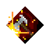
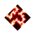

# 🥞 Pancake's Spear Info Chart

## 📊 Spear Info

.webp){ width="24" } / .webp){ width="24" } / .webp){ width="24" } are all incredible weapons with the highest reach in game allowing you to keep mobs at bay with { width="24" } for some of the highest survivability in game.

### Best unique:

.webp){ width="24" } is the best unique in the line, although it's just { width="24" } it does help with the pushback of the weapon allowing it to keep mobs away slightly better though Spear is great from simply being Spear.

### Playstyle:

You use Spears by utilizing the reach keeping a distance from mobs as much as you can, you hide behind cover and walls to put them in-between you and the enemy, doing this will keep any knockback able mob away but if you’re facing a threat not pushed back you move with the mob keeping it at the edge of your reach and yourself out of their reach.

### Best Enchants:

{ width="24" } is the entire core of the weapon, it singlehandedly puts it up multiple tiers by allowing it to group up and keep mobs at bay as it pulls mobs into the impact of your weapon, this also helps the AoE area.

{ width="24" } is the best damage enchant for it being 98.6% extra dps at base 86.3% extra dps with MAS, 56.3% extra dps with .webp){ width="24" }, and 48.1% extra dps with .webp){ width="24" } and MAS.
(MAS refers to the armor perk +25% Melee Attack Speed)
(This does not include the first hit which applies { width="24" }).

Though adding the speed from .webp){ width="24" } and MAS help perform better with more pushback and is more dps overall.

{ width="24" } is the next best damage enchant if you're on Apoc+ especially higher ones as it's 100% extra dps so enchanted mobs, your biggest threat on the difficulty.

{ width="24" } is 40% extra dps overall, though it can overkill and matter less Spear doesn't suffer enough to invalidate it.

{ width="24" } is basically a sidegrade to { width="24" } not activating on the first hit but being more consistent on following hits, it's about 35%-40% dps itself so overkill included on { width="24" } they do about the same, { width="24" } more to a boss.

{ width="24" } is simply 9% of your dps as healing after you kill a mob, although the weapon is defensive enough to be able to pass with even a { width="24" } tranged this is what you'd use if you need melee healing.

.webp){ width="24" } is simply just 50% damage reduction for 4 seconds upon a kill always halving the damage you take. Spear is already defensive but this can help when things go bad or against ranged mobs which can hit you or { width="24" } which will damage you for melee damage done.

### Honorable mentions/still solid Enchants:

.webp){ width="32" } upon kill melts your hardest hit even no health on damage, with .webp){ width="24" } Spear groove melts up life on an area as this can full multiple mobs, it also has knockback which can further help keep them at bay though the knockback Spear already has can make it less useful { width="24" } or { width="24" } etc demise.

.webp){ width="32" } is 60% direct damage reduction to whoever you hit and it is nearly a hit for 5 seconds. Spear grosses up mobs so this will all hit a lot though it doesn't contact stunt .webp){ width="24" } or { width="24" } etc demise.

.webp){ width="32" } (20 second cooldown) disables the damage a mob takes and makes it do 20% less direct damage, due to the reach of Spear mobs doesn't get great, it's a good backup, and can be used with the much additive damage or strength potions are already used or in junction with { width="24" }.

{ width="24" } if mad up to land on the final hit in every other combo will be 100% extra dps however if it gets misaligned the dps will instead be 34.0k. { width="24" } will also misalign it by itself and the 46% better that multiplying the dps is the 39% changes to prefer hitting and waiting more than just hitting for positboot as { width="24" } will benefit from the kills, it's mostly for fun as it's playstyle the knockback is better but it's solid damage and it's the best for { width="24" } based together.

{ width="24" } (30 second cooldown) gives you a 100% additive stat and additive Damage+, you can directly stack this with additive damage or strength potions are already used or in junction with { width="24" }.

{ width="24" } (30 second cooldown) doubles the damage a mob takes and makes it do 20% less direct damage, due to the reach of Spear mobs doesnt get great at level 25k, this can be used to hold ranged mobs in place which is an extreme help for melee and will cause can still shoot out.

{ width="24" } (20 second cooldown) puts up a barrier that blocks all projectiles when used for TSE seconds, at level 25k, this can be used to hold ranged mobs or avoid getting reflected though it is stationary and mobs who are inside can still shoot out, it also slows down mob attack and movement speed briefly.

{ width="24" } (20 second cooldown) puts up a barrier that blocks all projectiles when used for TSE seconds, at level 25k, this can be used to hold ranged mobs or avoid getting reflected though it is stationary and mobs who are inside can still shoot out.

{ width="24" } in an slight damage enchant at 33% extra dps if you don't get like others though just like .webp){ width="24" } is less additive but it does multiply with itself as you would be, it's attack spd and base stats.

{ width="24" } upon hit has a 30% chance to delete an entire group of mobs together for 3 seconds holding them in place which is for you with { width="24" } or { width="24" } so time your hit on a mob since it is stationary so you have a solid chance to activate it.

.webp){ width="24" } +  { width="24" } + and { width="24" } and learn towards { width="24" } or once its like diver changes to prefer hitting and waving more than just hitting for positboot as { width="24" } will benefit from the kills, it's mostly for fun as it's playstyle with the knockback is better but it's solid damage and is the best for { width="24" } based together.

{ width="24" } (20 second cooldown) puts up a barrier that blocks all projectiles when used for TSE seconds, of at least 25k, this can be used to hold ranged mobs getting reflected though it is stationary and mobs who are inside can still shoot out. Of at least 25k, this can be used to hold ranged melees or apply if they are approaching them quickly.

---

## 🎯 God Rolls

### After Apoc+

**Recommended Enchantments:**

{ width="32" } + { width="32" } + { width="32" } + .webp){ width="32" }

{ width="32" } + { width="32" } + { width="32" } + { width="32" }

{ width="32" } + { width="32" } + { width="32" } + { width="32" }

{ width="32" } + { width="32" } + { width="32" } + { width="32" }

### Before Apoc+

**Starting Enchantments:**

{ width="32" } + { width="32" } + { width="32" } + { width="32" }

{ width="32" } + { width="32" } + { width="32" } + .webp){ width="32" }

{ width="32" } + { width="32" } + { width="32" } + .webp){ width="32" }

{ width="32" } + { width="32" } + { width="32" } + { width="32" }

{ width="32" } + { width="32" } + { width="32" } +  { width="32" }

---

## 📈 Stats

Spear (at level 263)
- Base 721,929 damage for two hits and then 1,203,215 on the last hit.

The HPS of { width="24" } + .webp){ width="24" } is as follows:

Base: 19
+ **MAS 2.10**
+ .webp){ width="24" }: 3.4
+ **MAX: MAS 3.35**

The HPS of { width="24" } is as follows:

Base: 19
+ **MAS: 2.30**
+ .webp){ width="24" }: 3.82
+ **MAX: MAS 4.02**

The base dps of { width="24" } + .webp){ width="24" } is **1,050,418k**.

- The + .webp){ width="24" } dps of { width="24" } + .webp){ width="24" } is **4,468,014k**
- The + { width="24" } dps at MAX dps is **6,910,944k**

The base dps of { width="24" } is **1,305,476k**.

- The + .webp){ width="24" } dps of { width="24" } is **4,468,014k**
- The + { width="24" } + .webp){ width="24" } dps of { width="24" } is **8,936,028k**

---

## 🗺️ Locations you can obtain { width="24" } + .webp){ width="24" }:

- Creeper Woods (Apoc/Apoc+, .webp){ width="24" } CI)
- Squid Coast (Apoc/Apoc+, .webp){ width="24" } CI)
- Overgrown Temple (Apoc/Apoc+, .webp){ width="24" } CI)
- Colossal Rampart (Apoc/Apoc+, .webp){ width="24" } CII)
- Fiery Forge (Apoc/Apoc+, .webp){ width="24" } CII)
- Broken Citadel (.webp){ width="24" } CI)
- Nether (.webp){ width="24" } CII)
- Gauntlet Of Gales (.webp){ width="24" } CIII)
- Gift Wrapper (from another player)
- Ancient Hunt (any .webp){ width="24" } CII)
- Myriad Hunt (melee base)
- Tower (any Ancient Golem base { width="24" } .webp){ width="24" } without { width="24" })

---

## 🎯 For use with { width="24" } can use { width="24" } on the armor with .webp){ width="24" } if you want.

### Best enchantments:

- { width="24" } + .webp){ width="24" } + { width="24" } + { width="24" } + { width="24" } + { width="24" }

- { width="24" } + .webp){ width="24" } + { width="24" } + { width="24" } + { width="24" } + { width="24" }

- { width="24" } + .webp){ width="24" } + { width="24" } + { width="24" } + { width="24" } + { width="24" }

- { width="24" } + .webp){ width="24" } + { width="24" } + { width="24" } + { width="24" } + { width="24" }

- { width="24" } + .webp){ width="24" } + { width="24" } + { width="24" } + { width="24" } + { width="24" }

- { width="24" } + .webp){ width="24" } + { width="24" } + { width="24" } + { width="24" } + { width="24" }

- { width="24" } + .webp){ width="24" } + { width="24" } + { width="24" } + { width="24" } + { width="24" }

- { width="24" } + .webp){ width="24" } + { width="24" } + { width="24" } + { width="24" } + { width="24" }

- { width="24" } + .webp){ width="24" } + { width="24" } + .webp){ width="24" } + { width="24" }

- { width="24" } + .webp){ width="24" } + { width="24" }

- { width="24" } + .webp){ width="24" }

- { width="24" }

- { width="24" } + { width="24" }

- { width="24" } + .webp){ width="24" }

- .webp){ width="24" } + { width="24" } + { width="24" } + { width="24" }

- .webp){ width="24" } + { width="24" } + { width="24" } + { width="24" }

- .webp){ width="24" } + { width="24" } + { width="24" }

- .webp){ width="24" } + { width="24" } + { width="24" }

- .webp){ width="24" } + { width="24" } + { width="24" } + { width="24" }

- .webp){ width="24" } + { width="24" } + { width="24" } + { width="24" }

- .webp){ width="24" } + { width="24" } + { width="24" } + { width="24" }

- .webp){ width="24" } + { width="24" } + { width="24" } + { width="24" }

- .webp){ width="24" } + { width="24" } + { width="24" } + { width="24" }

- { width="24" } + .webp){ width="24" } + { width="24" } + { width="24" }

- { width="24" } + .webp){ width="24" }

- { width="24" } + .webp){ width="24" } + { width="24" } + { width="24" } + { width="24" } + { width="24" }

- { width="24" } + .webp){ width="24" } + { width="24" } + { width="24" } + { width="24" } + { width="24" }

---

## 🎯 With subzero on the armor with .webp){ width="24" } if you want.

It's highly recommended with Spear due to the majority of melee mobs now being unable to hit you meaning ranged mobs are your true threat.

The most optimal to support, Spear use would be:

- { width="24" } + .webp){ width="24" } + { width="24" } + { width="24" } + { width="24" } + { width="24" }

- { width="24" } + .webp){ width="24" } + { width="24" } + { width="24" } + { width="24" } + { width="24" }

---

*Guide created by Pancakecat - For more creative builds and strategies, check out the other guides!*

